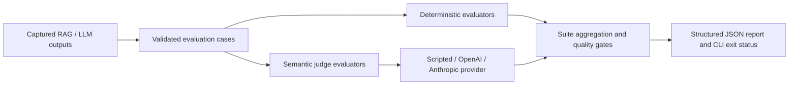

# AI Evaluation Harness

[](https://github.com/pranay-eligeti/ai-evaluation-harness/actions/workflows/ci.yml)

Reusable Python infrastructure for evaluating captured RAG and LLM outputs. The harness provides deterministic metrics, offline judge plumbing, repeatable suites, structured reports, and CI quality gates. It does not generate answers or run a retriever.

Version **0.3.0** adds captured RAG runs and paired regression evaluation: compare
baseline/candidate artifacts, inspect case-level changes, and apply absolute and
relative quality gates without a RAG runtime dependency or network access.

## Capabilities at a glance

| Layer | Implemented capabilities |
| --- | --- |
| Retrieval | Recall@K, Precision@K, reciprocal rank / MRR |
| Citations and answers | Citation F1/validity, normalized exact match, token F1, lexical groundedness |
| Semantic evaluation | Answer relevance and groundedness through provider-neutral judges; scripted fixtures and optional OpenAI/Anthropic SDK adapters |
| Execution | JSON/JSONL inputs, TOML suites, CLI, per-case results, aggregate metrics, configurable quality gates |
| Verification | pytest, strict mypy, Ruff, GitHub Actions, and offline SDK transport tests |
| Regression | Versioned RAG captures, conservative report compatibility, matched-case deltas, population summaries, and configurable mean/pass-rate regression gates |



Start with the credential-free synthetic suite below. Optional live evaluation uses the same report and gate architecture with explicit opt-in.

## Installation and use

Requires Python 3.12+.

```sh
python -m venv .venv
# Activate the environment using your shell's activation command.
python -m pip install -e ".[dev]"
ai-eval --help
ai-eval list-evaluators
ai-eval run --dataset examples/datasets/synthetic.json --config examples/suite.toml --report scratch/report.json
ai-eval run --dataset examples/datasets/synthetic.json --config examples/failing.toml --report scratch/failing.json
```

The first suite passes; the deliberately strict second suite exits 1. Exit codes: 0 passed, 1 failed gate or insufficient measurements, 2 invalid input/configuration or report I/O, 3 evaluator execution errors. `--evaluator` may be repeated without a config; `--k` sets the cutoff for that mode.

## Architecture and supported evaluations

`models` validates captured inputs; `datasets` loads JSON/JSONL atomically; pure `metrics` feed `evaluators`; `judges` separates requests, provider calls, and verdict parsing; `runner` aggregates each evaluator and applies gates; `reporting` emits stable JSON; `cli` coordinates file I/O.

Supported deterministic evaluators: Recall@K, Precision@K (two explicit denominator conventions), reciprocal rank (suite mean is MRR), citation F1, citation validity, normalized answer exact match, token F1, and explicitly labeled lexical groundedness. Semantic answer relevance and groundedness use provider-neutral LLM judge interfaces. The included scripted provider replays fixtures; it proves execution infrastructure, not model quality. Optional OpenAI and Anthropic adapters support live semantic evaluation; deterministic users need neither SDK nor credentials.

Reports contain schema/harness versions, dataset checksum and case metadata, resolved suite configuration, evaluator provenance, every case result, separate aggregates, gate explanations, and suite status. No single combined quality score is produced. Output is deterministic for identical dataset paths, bytes, configuration, and offline providers. JSON schemas can be obtained through `SuiteReport.model_json_schema()` and `EvaluationCase.model_json_schema()`.

## Validation

```sh
python -m pytest
ruff check src tests
ruff format --check src tests
mypy
```

Unit, integration, and subprocess CLI tests exercise the real synthetic dataset. GitHub Actions installs the package on Python 3.12, runs these checks, and verifies passing and failing sample gates.

## Quality gates and extensions

TOML `[[evaluators]]` entries specify `type`, `params`, and optional `min_case_score`. `[[gates]]` reference the evaluator instance name and configure minimum mean/pass rate/scored count and maximum skipped/error count. Scores and thresholds must be finite within [0,1]. Per-case verdicts are distinct from aggregate suite gates. Any execution error makes the suite an error even without gates.

Implement the `Evaluator` protocol or subclass `BaseEvaluator`; programmatic callers can pass instances to `run_suite`. Register new types for configuration/CLI use. Implement `JudgeProvider.complete` for additional provider adapters. `judge_responses` in TOML points to a scripted JSON fixture relative to the config file.

## Limitations

Lexical overlap cannot measure semantic truth, negation, paraphrases, or citation claim support. Source ID correctness depends on human annotations. Model judgments carry uncertainty and require calibration. Frozen input models prevent attribute reassignment but do not deeply freeze nested lists/dictionaries; callers must not mutate inputs during runs. Execution is synchronous and in-memory, with no dashboard, hosted API, database, or RAG pipeline. Live judge scores are uncertain and are not deterministic ground truth. Thresholds in the synthetic sample are regression fixtures, not production quality recommendations.

See [architecture](docs/ARCHITECTURE.md), [methodology](docs/EVALUATION_METHODOLOGY.md), [metric formulas](docs/METRICS.md), [judges](docs/LLM_JUDGES.md), and [CI gates](docs/CI_GATES.md).

## Optional semantic evaluation

The base install needs only Pydantic. Install only the SDK you need:

```sh
python -m pip install ".[openai]"
python -m pip install ".[anthropic]"
# Or install both: python -m pip install ".[providers]"
ai-eval run --dataset examples/datasets/synthetic.json --config examples/semantic-offline.toml --report scratch/semantic-offline.json
```

The offline semantic example replays synthetic recorded verdicts; it validates infrastructure and incurs no cost. For a live run, first replace the model placeholder in `examples/semantic-openai.toml` or `examples/semantic-anthropic.toml` with an account-accessible model that supports native JSON schema output. Set `OPENAI_API_KEY` or `ANTHROPIC_API_KEY` securely in your runtime environment, then explicitly opt in:

```sh
ai-eval run --dataset examples/datasets/synthetic.json --config examples/semantic-openai.toml --allow-live --report scratch/semantic-live.json
```

Live calls incur provider charges and send questions, answers, and (for groundedness) retrieved text to the selected provider. Installation, import, normal tests, and deterministic samples never make model calls. Keys are not accepted in TOML or CLI arguments, and `.env` files remain ignored; the harness does not automatically load them. Programmatic users can pass `api_key=` to `build_provider`, and should use its context manager to close the client. Injecting an SDK client bypasses environment/dependency construction and is suitable for offline transports; the caller owns that client.

Prompt version 2 separates relevance from factual correctness and faithfulness, embeds content as JSON data, and instructs the judge to ignore embedded instructions. These defenses reduce risk but cannot guarantee injection resistance. Faithfulness uses supplied context only. Missing/blank context skips; partial insufficient evidence and contradictions are explicitly assessed by the rubric.

Reports distinguish deterministic and model-judged scores and preserve criterion, provider, actual/configured model, prompt version, and attempts. Errors and skips preserve configured provenance. Reports still contain case metadata and judge reasoning, which may contain sensitive evaluation content; review datasets and restrict report access. No API keys, raw headers, SDK error bodies, or raw malformed outputs are intentionally persisted. Avoid SDK/HTTP debug logging with sensitive data.

Configuration-driven live suites emit report schema version 2 for the new `judge` configuration. Deterministic/scripted suites retain version 1 and the existing configuration shape. `SuiteReport` accepts both versions; readers handling live reports must support version 2. Package version is 0.3.0.

See [LLM judges](docs/LLM_JUDGES.md) for rubrics, configuration, retries, error taxonomy, and provider limitations. Real-SDK HTTP tests run offline when provider extras are installed and skip when they are absent; all fake adapter tests run in the base installation. No paid live test is required for verification.

## Offline RAG regression workflow

```bash
ai-eval run --capture examples/rag/baseline.json --config examples/rag/suite.toml --report scratch/baseline.json
ai-eval run --capture examples/rag/candidate.json --config examples/rag/suite.toml --report scratch/candidate.json
ai-eval compare --baseline scratch/baseline.json --candidate scratch/candidate.json --config examples/rag/regression-pass.toml --report scratch/comparison.json
```

Use `regression-fail.toml` for a deliberate regression failure (exit 1). The
baseline comes from the separate [RAG Knowledge Assistant](https://github.com/pranay-eligeti/rag-knowledge-assistant);
the candidate injects controlled output changes. See [comparison semantics](docs/REGRESSION_COMPARISON.md)
and [fixture regeneration](examples/rag/README.md). Existing dataset/report APIs remain compatible.
